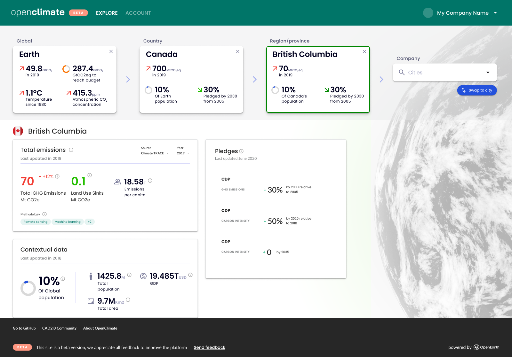

# OpenClimate

[OpenClimate](https://openclimate.network/) is a data utility for tracking climate action.

It provides a database and API for current and historical CO2 emissions data, emissions reduction targets, climate plans and actions, and geographical, demographic and economic contextual data.

It covers climate actors of all kinds, including countries, regions and provinces, cities, companies, down to specific emissions sites like factories and mines. OpenClimate connects these actors by geographic, political or business relationships to provided nested climate accounting.

The data explorer Web interface lets you discover and compare actors in this network.

## License

Copyright 2021-2023 [Open Earth Foundation](https://openearth.org/) and contributors.

Licensed under the Apache License, Version 2.0 (the "License");
you may not use this file except in compliance with the License.
You may obtain a copy of the License at

http://www.apache.org/licenses/LICENSE-2.0

Unless required by applicable law or agreed to in writing, software
distributed under the License is distributed on an "AS IS" BASIS,
WITHOUT WARRANTIES OR CONDITIONS OF ANY KIND, either express or implied.
See the License for the specific language governing permissions and
limitations under the License.

## Quick links

* [Code of Conduct](./CODE_OF_CONDUCT.md)
* [Contributing code](./CONTRIBUTING.md)
* [Contributing data](./CONTRIBUTING_DATA.md)
* [Running OpenClimate in Kubernetes](./k8s/README.md)
* [API documentation](./api/API.md)
* [Schema documentation](./api/schema/README.md)
* [Issues](https://github.com/Open-Earth-Foundation/OpenClimate/issues) ([good first issues](https://github.com/Open-Earth-Foundation/OpenClimate/issues?q=is%3Aissue+is%3Aopen+label%3A%22good+first+issue%22))