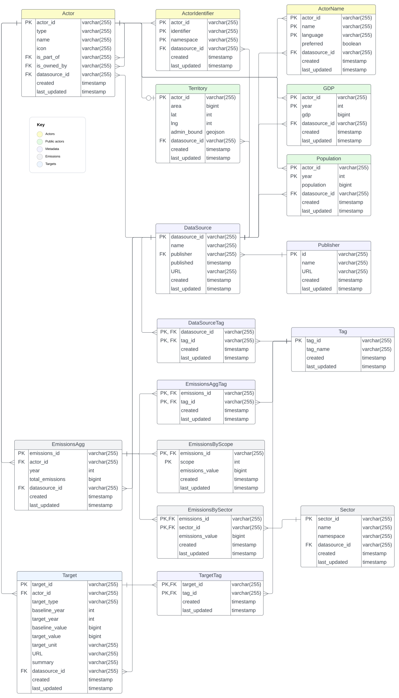

# OpenClimate Schema 1.0

This is the Schema for the OpenClimate 1.0 database. It's used by [OpenClimate](https://openclimate.network/) to store information about climate-related actors in both the public and private sector, their
actions and targets, and their relationships to one another.

The schema supports importing data sets from existing sources. It also
supports self-reported data in the OpenClimate interface.

# License

- Copyright 2022 Open Earth Foundation <https://openearth.org>
- Copyright 2022 Data Driven Envirolab <https://datadrivenlab.org/>

Licensed under the Apache License, Version 2.0 (the "License");
you may not use this file except in compliance with the License.
You may obtain a copy of the License at

http://www.apache.org/licenses/LICENSE-2.0

Unless required by applicable law or agreed to in writing, software
distributed under the License is distributed on an "AS IS" BASIS,
WITHOUT WARRANTIES OR CONDITIONS OF ANY KIND, either express or implied.
See the License for the specific language governing permissions and
limitations under the License.

# Source code

The [data-definition language](https://en.wikipedia.org/wiki/Data_definition_language) SQL source code is available in the `SQL` directory. There is one .sql file per table.

Open Earth Foundation (OEF) uses [PostgreSQL](https://postgresql.org/) for
hosting the database directly. Consequently, these SQL files use a
PostgreSQL-inflected dialect of SQL. They should probably work with
other relational database management systems, but might require some tuning.

The .sql files are functional, but their primary use is for documenting
the database structure.

The scripts are not [idempotent](https://en.wikipedia.org/wiki/Idempotence).
If you run `Actor.sql` a second time without dropping the table or
database, you will probably get an error.

Changes to the tables are made directly to each file; this makes them
useful for creating a new database, but bad for updating or altering
an existing database. OEF uses [db-migrate](https://db-migrate.readthedocs.io/) to manage changes to the OpenClimate database directly.

Note that some tables have dependencies on each other because of
foreign key definitions. The `tables.txt` file lists the tables in
dependency order, so this command should work for setting up a new
database:

```bash
for t in `<tables.txt`; do psql -f SQL/$t.sql; done
```

You may need to provide hostname, username, password, and database
parameters to `psql` to get this work correctly!

# Entity-relationship diagram

The following entity-relationship diagram (ERD) shows how the tables are structured and how they interact from a high level. See [Table details](#table-details) for more information about each table.



# Design principles

The schema follows a few design principles.

- `Singular table names`. "Actor" not "Actors", "Publisher" not "Publishers".
- `Externally-determined IDs`. Identities for rows are not randomly-generated,
incremental, or otherwise opaque. For most tables, it's possible to update
information from a datasource without querying the database directly, just
by using the same ID.
- `Data sources noted`. Most rows in tables include a `datasource_id` that
provides information about the provenance of the data.
- `Timestamped`. Most rows in table include a `created` and `last_updated`
timestamp column. These mark when the data was imported or updated in the
database, which helps with synchronisation and delivery over the Web. Publication date can be found in the `published` column of the related `DataSource` row.
- `Units translated at import time`. Upstream data sets may have varying units
for currency, emissions, land area, population. This database schema expects
those units to be converted at import time, not when extracting or comparing
data rows. This makes it easier to use the same database for multiple uses,
but it does require more work on the part of importers.
- `Generality`. We've erred on the side of generality in the design of the schema. Tables have columns that are relevant for all types of
actors. When we need to include information that's specific for particular
kinds of actors, we use the [Tag](#tag) subsystem to tag rows in tables with
extra information.
- `Multiple sources of truth`. For emissions data, we track multiple records of the same information, to provide comparison of methodologies and reporting style. For example, there are records for emissions in the United States from both PRIMAP and the UNFCCC, with about 0.3% difference. For non-emissions contextual data, like population, area, or GDP, multiple sources of truth aren't an important part of this data set, so we only track the best source we can get. For targets, we try to include one version of a target, even if it's mentioned in different data sources.

# Table details

These categories of table are marked in the ERD with different colours. They're not functionally important; all the tables are part of the same schema and database.

Undocumented tables in the `SQL` subdirectory that aren't listed here are actively used and haven't been fully tested. Don't use them.

Undocumented columns in tables named below that aren't called out aren't actively used and shouldn't be used by you.

The column descriptions below are descriptive; refer to the [ERD](#entity-relationship-diagram) for data types and keys.

## Actors

One of the big advantages of the OpenClimate schema is that actors in the climate change world are treated uniformly, regardless of their size or whether they are public or private.

### Actor

An Actor is an entity that is responsible for CO2 emissions in some way. Actors include countries; sub-national regions like states and provinces; cities; private entities like corporations; and sites owned by public or private actors, like mines, farms, factories, and office buildings.

OpenClimate does not track individual human beings as Actors.

- `actor_id`: a unique identifier for an Actor. We use different vocabularies
for different types of Actor, but they are all distinct and shouldn't conflict. See [ActorIdentifier](#actoridentifier) for mapping other
identifier namespaces onto this domain.
    - For countries, we use the [ISO 3166-1 alpha-2](https://en.wikipedia.org/wiki/ISO_3166-1_alpha-2) code. For example, Canada is `CA`.
    - For sub-national regions like states and provinces, we use the [ISO 3166-2](https://en.wikipedia.org/wiki/ISO_3166-2) code, including a
    dash ("-") between the country part and the region part. For example,
    `US-NC` is North Carolina, USA.
    - For cities, we use the [UN/LOCODE](https://en.wikipedia.org/wiki/UN/LOCODE), with a space (" ") between the country part and the LOCODE. For example, `ZM LUN` is Lusaka, Zambia.
    - For private entities, we use [LEI](https://en.wikipedia.org/wiki/Legal_Entity_Identifier). For example, the `actor_id` for Ford Motor
    Company is `20S05OYHG0MQM4VUIC57`.
    - For sites owned by other Actors, we use a namespaced version of the
    most relevant national identifier for that site, typically by an environmental regulator or tax agency. For example, a factory in
    Canada tracked by the Environment and Climate Change Canada (ECCC) has
    actor_id `CA:ECCC:10001`.
    - For planet Earth, `EARTH` is the actor ID. No other planets so far!
- `type`: A string representing the type of actor. This is less necessary than it seems, but it's helpful for managing geographical or organizational hierarchies. The main types in use:
    - `planet`: Only Earth.
    - `country`: nation-state or territory. Typically, anything
    with an ISO 3166-1 code.
    - `adm1`: top-level administrative region within a country. Typically,
    states or provinces.
    - `adm2`: second-level administrative regions. For example, England is
    an `adm1` within Great Britain, and Cornwall is an `adm2` within England.
    - `city`: a city, town, or village. For example, Richmond, Quebec, Canada.
    - `organization`: a private entity, like a corporation.
    - `site`: an emissions site, typically owned by an organization, like an
    office building, data center, mine, farm, power plant or factory.
- `name`: A default name to use for this actor. See the [ActorName](#actorname) table for more elaborate ways to handle multiple names in multiple languages.
- `icon`: Full URL of a small (512px x 512px or less) image representing
the actor. For public actors, this will be a flag. For private actors, this may be a logo. This is often null.
- `is_part_of`: actor_id of the immediate geographical parent of the Actor. For instance, the city of Jujuy (AR JUJ) is part of Jujuy state (AR-Y) which in turn is part of Argentina (AR), which is part of Earth (EARTH). This column only contains the most immediate parent; getting higher-level parents requires repeated queries. For `organization` actors, this is typically the
location of the main office, corporate registration, or other main jurisdiction, although this can be tricky for many large organizations. For `site` actors, this is usually a `city`, but sometimes an `adm1` or `adm2` if the site is outside city limits in rural, wilderness, or unincorporated territory.
- `is_owned_by`: an ownership or management relationship, not necessarily geographical. This is typically used to link a `site` to its owning `organization`. Public actors have null values here.
- `datasource_id`: ID of the [DataSource](#datasource) this actor came from. Typically from geographical or government registries, but sometimes actors are added from emissions or targets datasets that weren't otherwise tracked.
- `created`: When this row was added to the table. Not necessarily publication date; see the DataSource for that metadata.
- `last_updated`: When this row was changed. Often the same as `created`. Not necessarily publication date; see the DataSource for that metadata.

### ActorIdentifier

This is the table we use to track structured identifiers for Actors in different namespaces from our default ones. It helps with harmonizing datasets, especially those that use a structured identity format. For human-readable names, see [ActorName](#actorname).

The rows are unique on (`identifier`, and `namespace`). For example, there is only one entry for identifier '300' in namespace 'ISO-3166-1 numeric', with
actor_id = 'GR' (Greece).

To avoid complicated queries, we include the default `actor_id` namespace
in the ActorIdentifier table, too. So, there is an `ActorIdentifier` row
in `namespace` 'ISO-3166-1 alpha-2' with `identifier` 'GR' and `actor_id` 'GR'. This makes getting all the identifiers for an Actor, or looking up an actor by identifier and namespace, a simpler process, at the expense of slightly more storage and slightly ridiculous rows of data.

- `actor_id`: The identified [Actor](#actor).
- `identifier`: A string identifier. Numeric identifiers are represented as strings. Unique within a namespace, but probably not unique outside of them.
- `namespace`: The namespace of the identifier. Typically this is the name
of a structured vocabulary of identifiers. There's not much governance on the
namespaces, but here are some known values:
    - 'UNLOCODE'
    - 'Wikidata'
    - 'ISO-3166-1 alpha-3'
    - 'World Bank'
    - 'CDP'
    - 'ISO-3166-2'
    - 'ISO-3166-1 numeric'
    - 'ISO-3166-1 alpha-2'
- `datasource_id`: ID of the [DataSource](#datasource) this mapping came from. Sometimes from geographical data sources, sometimes from the first imports from a target or emissions dataset.
- `created`: When this row was added to the table. Not necessarily publication date; see the DataSource for that metadata.
- `last_updated`: When this row was changed. Often the same as `created`. Not necessarily publication date; see the DataSource for that metadata.

### ActorName

A human-readable name for an Actor. Actors can have multiple names in the same language, and multiple names in different languages. Two different
actors can have the same name in the same language, or in different languages.

For example, there are 21 actors with an `ActorName` row with name "Springfield", in the USA, Canada and South Africa. Actor names are sometimes but not always unique within a parent geographical (`is_part_of`) boundary.

See [ActorIdentifier](#actoridentifier) for structured identifiers in a namespace.

- `actor_id`: The [Actor](#actor) with the name.
- `name`: A human-readable name for the Actor. May have accented characters
or characters in other scripts, or right-to-left (RTL) presentation.
- `language`: the language for the name. Usually a 2-letter [ISO 639-1](https://en.wikipedia.org/wiki/List_of_ISO_639-1_codes), unless such a code doesn't exist, in which case we use the 3-letter ISO 639-2 code.
- `preferred`: Is this the preferred name to use for the actor in this language? Preference might include these factors, in no particular order:
    - Readability (Cocos Islands more readable than Territory of Cocos (Keeling) Islands, The)
    - Brevity (Bolivia is briefer than Plurinational State of Bolivia)
    - Frequency of use
    - Official use (example: Mumbai vs Bombay, Alphabet Inc. vs Google, Deere & Company vs. John Deere)
    - Current use
    - Word order
    - Clarity (example: United Kingdom is clearer than UK, North Korea is clearer than DPRK)
- `datasource_id`: ID of the [DataSource](#datasource) this name mapping came from. Sometimes from geographical data sources, sometimes from the first imports from a target or emissions dataset.
- `created`: When this row was added to the table. Not necessarily publication date; see the DataSource for that metadata.
- `last_updated`: When this row was changed. Often the same as `created`. Not necessarily publication date; see the DataSource for that metadata.

## Public-sector actor

For governments, we keep information about the territory governed as well as simple population and GDP metrics.

### Territory

"actor_id" varchar(255), /* Actor this territory represents */
  "area" bigint, /* Area in km^2 */
  "lat" int, /* Latitude of centroid or major landmark times 10000; 407494 => latitude 40.7494 */
  "lng" int, /* Longitude of centroid or major landmark times 10000; -739674 => longitude -73.9674 */
  "admin_bound" text, /* Geojson of boundary */
  "created" timestamp,
  "last_updated" timestamp,
  "datasource_id" varchar(255),

### Population

"actor_id" varchar(255), /* Actor ID of territory */
  "population" bigint, /* Population in units; 1000 => 1000 people */
  "year" int, /* Year of measurement, YYYY */
  "created" timestamp,
  "last_updated" timestamp,
  "datasource_id" varchar(255),

### GDP

(TBD)

## Metadata

(TBD)

### DataSource

(TBD)

### Publisher

(TBD)

### Tag

(TBD)

### DataSourceTag

(TBD)

## Emissions

(TBD)

## Targets

(TBD)

# Contributions

(TBD)

# Contact

(TBD)